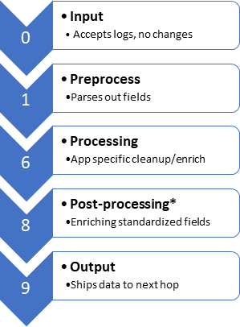

SEC555: LogStash Config Numbering Architecture
======

Logstash Naming Logic
------
Logstash can load a single configuration file or multiple. In production environments, it is recommended to seperate configuration files into seperate pieces. Doing this and using a standard naming convention provides many advantages such as:

1. Less code written/code reuse
2. Standardized field enrichment
3. Simplified configuration administration

For example:

- **0XXX** is for input files. These are used to accept logs off the network or pull logs from a database or log buffer. A file called **0001_input_firewall_palo_alto.conf** may accept firewall logs and **0002_input_bro_conn.conf** may accept bro conn logs
- **1XXX** is for initial parsing. These configuration files parse out the initial fields. **1001_firewall_palo_alto.conf** would parse out the fields for palo alto such as by using kv. **1002_bro_conn.conf** would parse out bro fields either with grok or csv.
- **8XXX** is for post processing. This is were standardized enrichment is applied. For example, you could take the field called source_ip and perform geoip lookups, threat intelligence feed checks, etc in a file called **8001_ip_enrichment.conf**. This file would work for both fields from bro_conn and the firewall logs.

With the example above you would not have to apply enrichment per each data source as the file 8001_ip_enrichment.conf does it for all logs that have a source_ip field.

Config Numbering Graphic
------
The initial recommendation is to use the below numbering schemes with your log files. The scheme uses four digit numbers at the beginning of each configuration file where the first number specifies what the configuration file function is intended for.

>   

**Warning:** **\*** Post processing assumes standardized field names such as **src\_ip**, **id.orig\_h, ip.src** renamed to **source\_ip**

SEC555 LogStash Configs
------

### **SEC555 VM**
> LogStash config files are stored on SEC555VM at: **`/opt/Logstash-Configs/configfiles`**

### **GitHub**
> Justin Henderson's (@SecurityMapper) LogStash Configs on GitHub:
> <https://github.com/HASecuritySolutions/>
